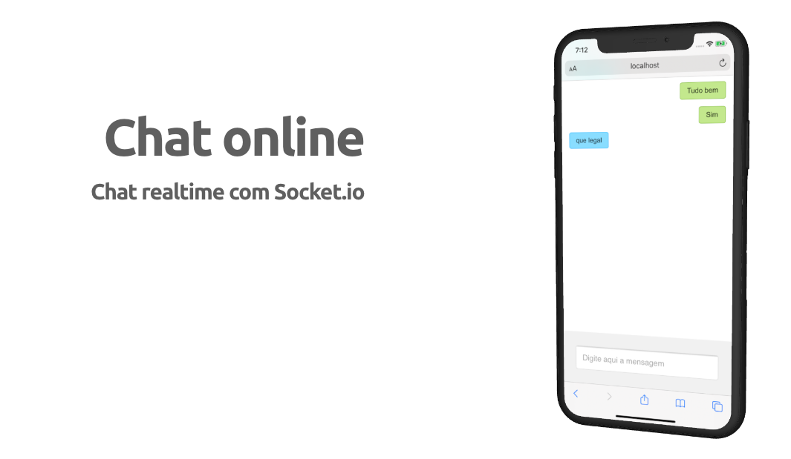

<h4 align="center">
    
</h4>

## :bookmark: Sobre

Chat real time simples, simulando uma conversa entre duas pessoas, com Socket.io, Node e React.

## :rocket: Tecnologias Utilizadas

O projeto foi desenvolvido utilizando as seguintes tecnologias

- [Node.js]
- [Socket.io]
- [Recat.js]

## :iphone: Telas

<h4 align="center">
    

</h4>

---

<h4 align="center">
    Feito com 💜 by Deusdete Filho</a>
</h4>
